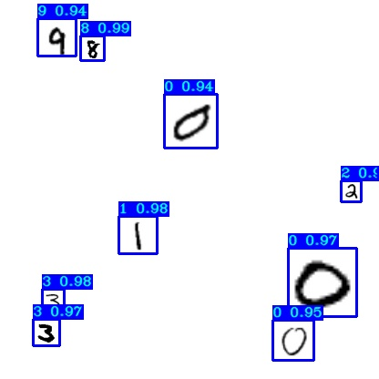

# TensorFlow-2.x YOLOv4 tutorials

YOLOv4 implementation in TensorFlow 2.x, with support for training, transfer training, object tracking mAP and so on...
Code was tested with following specs:
- i7-7700k CPU and Nvidia 1080TI GPU
- OS Ubuntu 18.04
- CUDA 10.1
- cuDNN v7.6.5
- TensorRT-6.0.1.5
- Tensorflow-GPU 2.3.1
- Code was tested on Ubuntu and Windows 10 (TensorRT not supported officially)

## Installation
First, clone or download this GitHub repository.
Install requirements and download pretrained weights:
```
pip install -r ./requirements.txt

# yolov3
wget -P model_data https://pjreddie.com/media/files/yolov3.weights

# yolov3-tiny
wget -P model_data https://pjreddie.com/media/files/yolov3-tiny.weights

# yolov4
wget -P model_data https://github.com/AlexeyAB/darknet/releases/download/darknet_yolo_v3_optimal/yolov4.weights

# yolov4-tiny
wget -P model_data https://github.com/AlexeyAB/darknet/releases/download/darknet_yolo_v4_pre/yolov4-tiny.weights
```

## Quick start
Start with using pretrained weights to test predictions on both image and video:
```
python detection_demo.py
```

<p align="center">
    </a>
</p>

## Quick training for custom mnist dataset
mnist folder contains mnist images, create training data:
```
python mnist/make_data.py
```
`./yolov3/configs.py` file is already configured for mnist training.

Now, you can train it and then evaluate your model
```
python train.py
tensorboard --logdir=log
```
Track training progress in Tensorboard and go to http://localhost:6006/:
<p align="center">
    </a>
</p>

Test detection with `detect_mnist.py` script:
```
python detect_mnist.py
```
Results:
<p align="center">
    </a>
</p>
